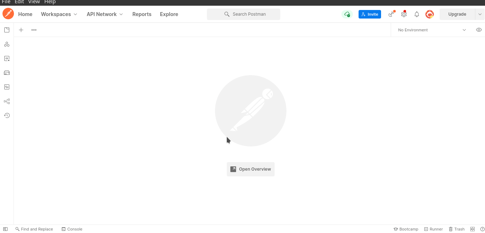
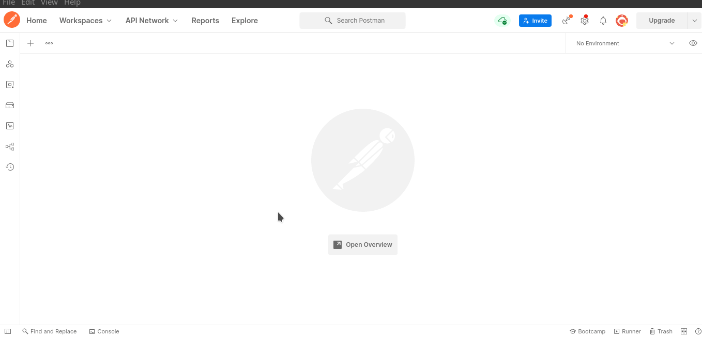

[Перелік усіх робіт](README.md)

# Лабораторна робота №10. Використання програми Postman для емуляції дій користувача сайту

## Мета роботи

Навчитися емулювати HTTP-запити різної складності, досліджувати поведінку сервера, аналізувати хід авторизації та помилки різних запитів.

## Обладнання

Персональний комп'ютер. Пакет програм XAMPP. Текстовий редактор Sublime Text 3 або IDE NetBeans. Web-браузер Chrome, Firefox, Opera, Postman

## Теоретичні відомості

### Postman 

Postman - це популярний інструмент для тестування та розробки веб-сервісів, який дозволяє взаємодіяти з HTTP-ресурсами шляхом створення, відправки та аналізу HTTP-запитів і відповідей. Postman надає зручний інтерфейс для розробників та тестувальників для виконання наступних завдань:

1. Створення запитів: Postman дозволяє створювати різні типи HTTP-запитів, такі як GET, POST, PUT, DELETE і багато інших. Ви можете налаштовувати заголовки, параметри запиту і дані для надсилання.
2. Автоматизація завдань: Ви можете автоматизувати тестові сценарії, створюючи колекції запитів і виконуючи їх послідовно або паралельно. Це корисно для тестування API та автоматизації завдань.
3. Середовища (Environments): Postman дозволяє створювати різні середовища, де можна зберігати змінні, такі як URL, токени автентифікації, інші параметри. Це дозволяє легко переключатися між різними конфігураціями для тестування.
4. Автентифікація: Postman підтримує різні методи автентифікації, включаючи базову автентифікацію, OAuth і багато інших. Ви можете налаштовувати автентифікацію для вашого API.
5. Перевірка відповідей: Postman дозволяє додавати тести до запитів, які перевіряють відповіді API на відповідність очікуваному результату. Це допомагає виявляти помилки та проблеми в API.
6. Моніторинг: Postman надає можливість моніторити та аналізувати використання API, включаючи статистику запитів та час відповідей.
7. Спільна робота: Postman дозволяє спільно працювати над колекціями запитів і середовищами, обмінювати ними з колегами.
8. Скрипти (Scripts): Ви можете використовувати JavaScript-скрипти для автоматизації додаткових завдань в Postman, таких як генерація даних чи обробка відповідей.

Postman є надзвичайно корисним інструментом для розробників, тестувальників та тих, хто працює з веб-сервісами та API. Він допомагає спростити та полегшити роботу з HTTP-запитами та дозволяє ефективно тестувати та розробляти програмне забезпечення, яке взаємодіє з веб-ресурсами.

## Хід роботи

1. Встановіть десктопну версію Postamn або використайте web-версію даного програмного забезпечення.
2. Створіть аккаунт Postman або вторизуйтесь через Google-аккаунт
3. Створіть нову область запитів, якщо це необхідно та виконайте запит до тестових API `https://jsonplaceholder.typicode.com/posts` та `https://jsonplaceholder.typicode.com/posts`

4. Додайте параметри, як показано нижче
   

5. Параметри форми передаються за допомогою запитів POST. Натисніть «+» → POST → до адресного рядка додайте `https://postman-echo.com/post`. У тілі запиту (Body) виберіть вкладку form-data та заповніть необхідні поля → надішліть (Send).
6. Додайте до запиту файл. Для цього у form-data поміняйте тип параметра з Text на File. Отримана відповідь зберігатиметься у розділі Files.
   

7. Перевірте роботу авторизації Postman API. Змініть метод на GET. Перейдіть на вкладку Authorization → Натисніть Type → Basic Auth. Введіть ім'я користувача – postman, пароль – password → Send. Якщо протокол авторизації працює коректно, сервер видасть: authenticated: true. У якості API авторизації використайте `https://postman-echo.com/basic-auth.`.

8. Протестуйте API `https://jsonplaceholder.typicode.com/users` з використанням методу POST. Натисніть «+» → Виберіть запит POST → Введіть URL-адресу https://jsonplaceholder.typicode.com/users → Перейдіть до розділу Body → Виберіть Raw > JSON → Введіть дані користувача → Send. Якщо запит виконаний коректно, ви побачите статус "201 Created".
9. Зробіть аналіз всіх виконаних вами дій, опишіть зміст запиту та відповіді у табличному вигляді. Додайте до таблиці інформацію про HTTP заголовки, та передані параметри.
10. Для кожного етапу роботи зробити знімки екрану та додати їх у звіт з описом кожного скіншота
11. Додати програмний код завдання для самомтійного виконання
12. Дати відповіді на контрольні запитання
13. Зберегти звіт у форматі PDF

## Контрольні питання
1. Що таке Postman і які завдання він вирішує в розробці програмного забезпечення?
2. Які основні типи HTTP-запитів можна створити за допомогою Postman?
3. Як встановлюються параметри запиту та дані для надсилання в Postman?
4. Які методи автентифікації підтримуються в Postman для взаємодії з захищеними API?
5. Як можна моніторити та аналізувати використання API за допомогою Postman?
6. Як використовувати скрипти в Postman для автоматизації додаткових завдань під час роботи з API?

## Довідники та додаткові матеріали
1. [Postman](https://www.postman.com/)
2. [Postman documentation](https://learning.postman.com/docs/introduction/overview/)
3. [Знайомтесь, Postman - must have для QA](https://qagroup.com.ua/publications/znajomtes-postman-must-have-dlia-qa/)
4. [Фичи Postman, которые облегчат жизнь тестировщика: пошаговая инструкция с видео](https://highload.today/blogs/fichi-postman-kotorye-oblegchat-zhizn-testirovshhika-poshagovaya-instruktsiya-s-video/)
5. [Postman echo service](https://postman-echo.com/get)
6. [{JSON} Placeholder Fake API](https://jsonplaceholder.typicode.com/)
7. [JSON Placeholder Guide](https://jsonplaceholder.typicode.com/guide/)

