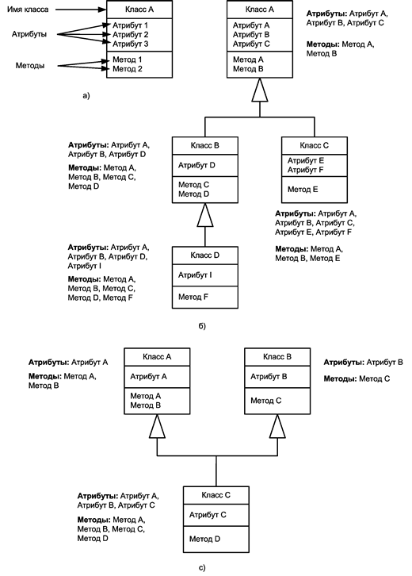

# Лекція 10. Об'єктно-орієнтоване програмування ч.1

[Перелік лекцій](../README.md)


## Основні поняття ООП

Ми живемо у світі об'єктів. Стіл, автомобіль, ручка, класна дошка - все це об'єкти. Поряд з фізичними існують так само абстрактні об'єкти, типовими представниками яких є числа. Таким чином, об'єкт - це будь-яка фізична чи абстрактна сутність. Об'єкт - це загальнофілософське поняття, яке вивчалося філософами протягом тривалого часу.

**Об'єкти характеризуються атрибутами.** Так атрибутами автомобіля є максимальна швидкість, потужність двигуна, колір кузова й т.д. Атрибутами підсилювача є частотний діапазон, вихідна потужність, коефіцієнт нелінійних спотворень, рівень шуму і т. д.

Крім атрибутів об'єкти володіють деякими функціональними можливостями, які в об'єктно-орієнтованому програмуванні (ООП) називають **операціями** або **методами**. Так автомобіль може їздити, корабель - плавати, комп'ютер - робити обчислення.

Таким чином, об'єкт інкапсулює атрибути і методи, приховуючи від інших об'єктів взаємодіючих з ним і які використовують його функціональність, свою реалізацію. Так для того щоб переключити телевізійну програму нам достатньо на пульті дистанційного керування набрати її номер, що запустить складний механізм, який у результаті і призведе до бажаного результату. Нам абсолютно не обов'язково знати, що відбувається в пульті дистанційного керування і телевізорі, нам лише достатньо знати, що телевізор має такою можливість. Інкапсуляція або приховування реалізації є базовою властивістю ООП. Вона дозволяє створювати призначені для користувача об'єкти, що володіють необхідними методами і далі оперувати ними, не вдаючись у структуру цих об'єктів.

**Об'єкт** - це екземпляр деякого класу об'єктів або просто класу. Так автомобіль Audi 6 є екземпляром класу автомобілів даної моделі, приймач Sony SW-7600G так само буде представником класу однойменних приймачів. Таким чином, клас - це абстрактне поняття. Ставлення класу і об'єкту приблизно таке ж, як платонівські ідеї та об'єкти реального світу. На UML - уніфікованій мові моделювання - клас відображається у вигляді прямокутника, розділеного на три частини. У першій міститься ім'я класу, в другій - атрибути, в третій - методи (рис. 1, а).



Рис. 1. Зображення класу і відносин генералізації в UML: а - зображення класу; б - одиночне успадкування; с - множинне спадкування

Класи можуть бути пов'язані один з одним різними відносинами. Одним з основних таких відносин є ставлення клас - підклас, відомий в об'єктно-орієнтованому програмуванні як наслідування. Наприклад, клас автомобілів Audi 6 є підкласом легкових автомобілів, який в свою чергу входить у більший клас автомобілів, а останній є підкласом класу транспортних засобів, який крім автомобілів включає в себе літаки, кораблі поїзди і т. д. Прикладом подібних відносин, є системи класифікації в ботаніці та зоології. Ставленням, зворотним спадкоємству, є узагальнення або генералізація. Вона вказує, що якийсь клас, є більш загальним (узагальненим) класом іншого класу. Клас транспортних засобів, наприклад, є генералізацією класів автомобілів, літаків і кораблів. У UML прийнято користуватися саме поняттям генералізація, що відбилося і в символі, що представляє це ставлення: більш не зафарбована стрілка, спрямована на клас, що є узагальненням деяких класів (рис. 1, б).

При спадкуванні всі атрибути і методи батьківського класу успадковуються **класом-нащадком**. Спадкування може бути багаторівневим, і тоді класи, що знаходяться на нижніх рівнях ієрархії, успадкують всі властивості (атрибути і методи) всіх класів, прямими або непрямими нащадками яких вони є. Клас B успадкує атрибути і методи класу A і, отже, буде мати атрибутами A, B, C і D і методами A, B, C і D, а клас C - атрибутами A, B, C, E, F і методами A, B і E.

Крім одиничного, існує і **множинне** спадкування, коли клас успадковує відразу кілька класів (рис. 1, с). При цьому він успадкує властивості всіх класів, нащадком яких він є. Проте в мовіphp таке спадкування не реалізовано.

При спадкуванні одні методи класу можуть заміщатися іншими. Так, клас транспортних засобів буде мати узагальнений метод руху. У класах-нащадках цей метод буде конкретизований: автомобіль буде їздити, літак - літати, корабель - плавати. Така зміна семантики методу називається поліморфізмом. Поліморфізм - це виконання методом з одним і тим же ім'ям різних дій залежно від контексту, зокрема, від приналежності того чи іншого класу. У різних мовах програмування поліморфізм реалізується різними способами.

Іншим основним видом відносин між класами та об'єктами є агрегація. Вона означає, що один клас містить в собі агрегати (складових частин, підсистем) інших класів. Так автомобіль складається з кузова, двигуна, трансмісії і т.п., а до складу приймально-передавального пристрою входять передавач, приймач і антенно-фідерний пристрій. У UML агрегації позначаються у вигляді лінії з зафарбовані ромбом на кінці. Агрегація має кратність. Так автомобіль зазвичай містить один двигун, який у свою чергу може належати тільки одному автомобілю. Автомобіль може звичайно містити від двох до п'яти дверей. У свою чергу кожні двері можуть належати лише одному автомобілю.

Щоб звернутися до атрибутів і методів агрегату, необхідно спочатку отримати вказівник на його власника, а потім вже вибрати необхідні атрибути і методи.

Хай об'єкт E має методи f1() і f2() (рис. 2). Щоб скористатися ними, треба спочатку отримати покажчик на кореневий об'єкт А, потім на об'єкт С, що в об'єктно-орієнтованому програмуванні зазвичай записується таким чином:

A.C

Далі отримуємо покажчик на D, так як він є агрегатом C, і, нарешті, викликаємо необхідні методи f1() і f2():

A.C.D.f1()

A.C.D.f2()


Рис. 2. Ієрархічне представлення вкладених об'єктів

Композиція є ще одним відношенням, родини агрегації. Але якщо в агрегації агрегати належать класу чи об'єкту, то в композиції існує більш слабкий зв'язок. Так, студенти з вузом перебувають у відношенні композиції, тоді як факультети, які входять до складу вузу (тобто є його невід'ємною частиною або агрегатами), пов'язані з нею відношенням агрегації. На UML композиція позначається за допомогою незамальованих ромбів. Як і у випадку агрегації, ставлення композиції має кратність. Агрегація та композиція є підкласами класу відносин асоціації. Асоціація позначається у вигляді лінії без стрілок і ромбів та може приймати вигляд як агрегації, так і композиції. На ранніх етапах об'єктно-орієнтованого аналізу і проектування часто задаються відносини асоціацій, а свою конкретизацію у вигляді агрегацій і композицій вони отримують на більш пізніх етапах.

Існує хибна думка, що об'єктно-орієнтоване програмування є чимось складним і незрозумілим. Але об'єктна декомпозиція є нітрохи не менш природною і інтуїтивно зрозумілою, ніж алгоритмічна, яка неподільно панувала до появи ООП. У програмуванні основні поняття ООП перейшли з інших галузей знань, таких як філософія, логіка, математика і семіотика, причому, не зазнавши особливих змін, принаймні того, що стосується суті цих понять. Об'єктний спосіб декомпозиції (подання) є природним, і застосовується протягом багатьох століть. Тому не дивно, що в процесі еволюції технології програмування він зайняв належне місце і підтримується так чи інакше практично всіма сучасними алгоритмічними мовами.

## Класи і об'єкти вphp


### Термінологія

**Клас.** Тип даних, який визначається програмістом, який включає локальні функції і локальні дані. Клас може розглядатися як шаблон для створення будь-якої кількості копій об'єкта одного і того ж типу (або класу).

**Об'єкт** Окрема копія структури даних, визначається класом. Визначення класу формулюється тільки один раз, після чого створюються всі необхідні об'єкти, які до нього належать.

**Властивість** (називається також змінна класу, атрибутом або полем-членом). Один з іменованих компонентів опису даних у визначенні класу.

**Метод** (називається також функцією-членом). Компонент класу, який за своїм призначенням є функцією.

**Абстракція** - це надання об'єкту характеристик, які відрізняють його від усіх інших об'єктів, чітко визначаючи його концептуальні межі. Основна ідея полягає в тому, щоб відокремити спосіб використання складових об'єктів даних від деталей їх реалізації у вигляді більш простих об'єктів, подібно до того, як функціональна абстракція поділяє спосіб використання функції і деталей її реалізації в термінах більш примітивних функцій, таким чином, дані обробляються функцією високого рівня за допомогою виклику функцій низького рівня. Такий підхід є основою об'єктно-орієнтованого програмування. Це дозволяє працювати з об'єктами, не вдаючись в особливості їх реалізації. У кожному конкретному випадку застосовується той чи інший підхід: інкапсуляція, поліморфізм або успадкування. Наприклад, при необхідності звернутися до прихованих даних об'єкту, слід скористатися інкапсуляцією, створивши, так звану, функцію доступу або властивість.

**Успадкування.** Процес визначення класу на основі іншого класу. На новий (дочірній) клас за замовчуванням поширюються всі визначення змінних екземпляра і методів із старого (батьківського) класу, але можуть бути також визначені нові компоненти або «перевизначені» визначення батьківських функцій. Прийнято вважати, що клас А успадковує свої визначення від класу В, якщо клас А визначений на основі класу В зазначеним способом.

**Поліморфізм** - так називають явище, при якому функції (методу) з одним і тим же ім'ям відповідає різний програмний код (поліморфний код) в залежності від того, об'єкт якого класу використовується при виклику даного методу. Поліморфізм забезпечується тим, що в класі-нащадку змінюють реалізацію методу класу-предка з обов'язковим збереженням сигнатури методу. Це забезпечує збереження незмінного інтерфейсу класу-предка і дозволяє здійснити зв'язування імені методу в коді з різними класами - з об'єкта якого класу здійснюється виклик, з того класу і береться метод з такою назвою. Такий механізм називається динамічним зв'язуванням - на відміну від статичного зв'язування, здійснюваного на етапі компіляції.

**Інкапсуляція** - це принцип, згідно з яким будь-який клас повинен розглядатися як чорний ящик - користувач класу повинен бачити і використовувати тільки інтерфейсну частину класу (тобто список декларованих властивостей і методів класу) і не вникати в його внутрішню реалізацію. Тому дані прийнято інкапсулювати в класі таким чином, щоб доступ до них на читання чи запису здійснювався не безпосередньо, а за допомогою методів. Принцип інкапсуляції (теоретично) дозволяє мінімізувати кількість зв'язків між класами і, відповідно, спростити незалежну реалізацію та модифікацію класів.

**Приховування даних -** невіддільна частина ООП, керуюча областями видимості. Є логічним продовженням інкапсуляції. Метою приховування є неможливість для користувача дізнатися або зіпсувати внутрішній стан об'єкта.

**Батьківський клас** (або суперклас, або базовий клас). Клас, визначення якого успадковані іншим класом.

**Дочірній клас** (або підклас, або похідний клас). Клас, який успадковує свої визначення від іншого класу.

**Конструктор -** це той же метод об'єкта, який викликається автоматично при його створенні. Як правило, конструктори використовуються для присвоєння первинних значень властивостей об'єкта. Вphp4 ім'я конструктора повинно відповідати імені класу.

**Деструктор -** аналогічний конструктору за винятком того, що викликається при знищенні об'єкта. Наприклад в деструктор може бути вбудована функція розриву з'єднання з базою даних або збереження файлу. Деструктори не присутні вphp4, але в 5 версії вони є. Ім'я методу деструктора заздалегідь визначено - `__destruct`.

## Синтаксис


### Опис класу і створення об'єкта

Синтаксис для створення класу досить простий: необхідно оголосити клас, використовуючи ключове слово class, за яким слідує назва класу і фігурні дужки ({}):

```php
<?php
class MyClass
{
    // Методи класу
}
?>
```
Після створення класу, новий клас може бути створено та збережено у змінній за допомогою ключового слова new:

```php
$Ob = new MyClass
```
Щоб побачити вміст класу, використовується функція var\_dump():
```php
var_dump($Ob);
```
Давайте зараз спробуємо з'єднати весь перерахований вище код і додати його до вашого test.php на вашому локальному сервері.
```php
<?php
class MyClass
{
    // Методи класу
}
$Obj = new MyClass();
var_dump($obj);
?>
```
Завантажте сторінку в браузері за адресою [http://localhost/test.php](http://localhost/test.php) На дисплеї має висвітитися це:
```
object (MyClass) # 1 (0) {}
```
Можна сказати, що ми створили найпростішу програму використовуючи ООП

## Визначення властивостей класу

Щоб додати до класу властивості, потрібно переробити наш клас приблизно так:

```php
<?php
class MyClass
{
    public $prop1 = "I'm a class property!";
}
$Obj = new MyClass();
var_dump($obj);
?>
```
**Властивості класу -** це специфічні змінні, які пов'язані з об'єктом класу і можуть бути доступні виключно через клас.

**public -** це атрибут видимості даної змінної, про які ми поговоримо трохи пізніше. Після нього слідує змінна, якій присвоюється значення "I'm a class property!";

Для виведення даної властивості у вікно браузера, необхідно написати:

```php
echo $obj->prop1;
```
Оскільки може існувати кілька об'єктів класу, визначити до якого класу яка властивість відноситься можна за допомогою "->".

Давайте змінимо test.php замінивши попередній код на цей:
```php
<?php
class MyClass
{
    public $prop1 = "I'm a class property!";
}
$Obj = new MyClass();
echo $obj->prop1; // Output the property
?>
```
Тепер в браузері ми побачимо:
```
I'm a class property!
```
## Псевдо-змінна $this


Псевдо-змінна $this доступна в тому випадку, коли метод був викликаний в контексті об'єкта. $this є посиланням на об'єкт, що викликається. Зазвичай це той об'єкт, якому належить викликаний метод, але може бути й інший об'єкт, якщо метод був викликаний статично з контексту іншого об'єкта. Це показано на наступних прикладах:

**Приклад 1** змінна $this в об'єктно-орієнтованій мові
```php
<?php
class a
{
    function foo()
    {
        if (isset($this)) {
            echo '$this визначена (';
            echo get_class($this);
            echo ") \\ n";
        } else {
            echo "\\ $this не визначена. \\ n";
        }
    }
}

class b
{
    function bar()
    {
        a::foo();
    }
}

$a = new a();
$a->foo();
a::foo();
$b = new b();
$b->bar();
b::bar();
?>
```
Результат виконання цього прикладу:
```
$this визначена (a)

$this не визначена.

$this визначена (b)

$this не визначена.
```
## Визначення методів класу

**Методи -** це специфічні функції класу, які будуть виконувати деякі дії в класі.

Наприклад, для створення методів, які будуть встановлювати і отримувати значення властивостей класу $prop1, додайте наступні рядки до вашого коду:
```php
<?php
class MyClass
{
    public $prop1 = "I'm a class property!";

    public function setProperty($newval)
    {
        $this->prop1 = $newval;
    }

    public function getProperty()
    {
        return $this->prop1 . "";
    }
}

$Obj = new MyClass();

echo $obj->prop1;
?>
```
**Примітка:**

Для виклику методів класу не забувайте використовувати знак долара.

Приклад $ob->set();

Тепер давайте спробуємо скористатися написаним вище класом шляхом модифікації файлу test.php:
```php
<?php
class MyClass
{
    public $prop1 = "Я властивість класу!";

    public function setProperty($newval)
    {
        $this->prop1 = $newval;
    }

    public function getProperty()
    {
        return $this->prop1 . "";
    }
}

$obj = new MyClass();
echo $obj->getProperty(); // Дізнаємось значення властивості
$obj->setProperty("Я НОВА властивість класу!"); // Встановлюємо нове
echo $obj->getProperty(); // Зчитуємо значення ще раз
?>
```
У браузері ви побачите:
```
Я властивість класу!

Я НОВА властивість класу!
```
Справжню силу ООП можна побачити при створенні декількох об'єктів одного і того ж класу.
```php
<?php
class MyClass
{
    public $prop1 = "Я властивість класу!";

    public function setProperty($newval)
    {
        $this->prop1 = $newval;
    }

    public function getProperty()
    {
        return $this->prop1 . "";
    }
}

// Створюємо два об’єкти
$obj = new MyClass();
$obj2 = new MyClass();

// Дізнаємося значення $prop1 з обох об’єктів
echo $obj->getProperty();
echo $obj2->getProperty();

// Встановлюємо нові значення
$Obj->setProperty("Я нове значення!");
$Obj2->setProperty("Я друге значення!");

// Виводимо $prop1 значення
echo $obj->getProperty();
echo $obj2->getProperty();
?>
```
Після заміни вмісту файлу test.php ми побачимо:
```
Я властивість класу!

Я властивість класу!

Я нове значення!

Я друге значення!
```
## Використання конструкторів і деструкторів

До таких методів відноситься метод `__construct()`, що дозволяє задати будь-які дії при створенні об'єкта, і метод `__destruct()`, що дозволяє задати дії при видаленні об'єкта (наприклад: розірвати з'єднання з базою даних). Для наочності, візьмемо приклад:
```php
<?php
class MyClass
{
    public $prop1 = "Я властивість класу!";

    public function __construct()
    {
        echo 'Клас "', __CLASS__, '" було створено!';
    }

    public function __destruct()
    {
        echo 'Клас "', __CLASS__, '" було знищено.';
    }

    public function setProperty($newval)
    {
        $this->prop1 = $newval;
    }

    public function getProperty()
    {
        return $this->prop1 . "";
    }
}

// Створення нового об'єкта
$obj = new MyClass();

// Отримуємо значення $prop1
echo $obj->getProperty();

// Виводимо повідомлення про закінчення файлу
echo "End of file.";
?>
```
Після виконання даного коду ми побачимо наступний результат:
```
Клас "MyClass" було створено!

Я властивість класу!

Кінець файлу.

Клас "MyClass" було знищено.
```
Хотілося б звернути вашу увагу, що після завершення виконання скрипта,php автоматично звільняє пам'ять.

**Примітка:**

Константа `__CLASS__` використовується для отримання імені класу, в якому вона викликається.

Для того, щоб знищити об'єкт вручну, нам необхідно скористатися функцією `unset()`

**Невеликий приклад:**
```php
<?php
class MyClass
{
    public $prop1 = "Я властивість класу!";

    public function __construct()
    {
        echo 'Клас "', __CLASS__, '" було створено!';
    }

    public function __destruct()
    {
        echo 'Клас "', __CLASS__, '" було знищено.';
    }

    public function setProperty($newval)
    {
        $this->prop1 = $newval;
    }

    public function getProperty()
    {
        return $this->prop1 . "";
    }
}

// Створення об'єкта
$bj = new MyClass();

// Отримання значення $prop1
echo $obj->getProperty();

// Знищуємо об'єкт \[/ b\]
unset($obj);

// Висновок повідомлення про закінчення файлу
echo "Кінець файлу.";
?>
```
Результат виконання скрипта буде наступним:

Клас "MyClass" було створено!

Я властивість класу!

Клас "MyClass" було знищено.

Кінець файлу.

Конструктори в класах-батьків не викликаються автоматично. Щоб викликати конструктор, оголошений в батьківському класі, слід звернутися до методу `parent::__construct()`.

## Успадкування


**Успадкування -** один з чотирьох найважливіших механізмів об'єктно-орієнтованого програмування (поряд з інкапсуляцією, поліморфізмом і абстракцією), що дозволяє описати новий клас на основі вже існуючого (батьківського), при цьому властивості і функціональність батьківського класу запозичуються новим класом.

Говорячи простими словами спадкування, це такий механізм, який дозволяє розширювати клас за рахунок методів іншого класу. Для того, щоб додати методи і властивості іншого класу, необхідно скористатися словом extends. Наприклад, щоб створити другий клас, який розширює MyClass і додає методи, ви повинні додати наступні рядки в наш тестовий файл:
```php
<?php
class MyClass
{
    public $prop1 = "Я властивість класу!";

    public function __construct()
    {
        echo 'Клас "', __CLASS__, '" було створено!';
    }

    public function __destruct()
    {
        echo 'Клас "', __CLASS__, '" було знищено.';
    }

    public function __toString()
    {
        echo "Використовуємо метод toString:";
        return $this->getProperty();
    }

    public function setProperty($newval)
    {
        $this->prop1 = $newval;
    }

    public function getProperty()
    {
        return $this->prop1 . "";
    }
}

class MyOtherClass extends MyClass
{
    public function newMethod()
    {
        echo "Із нового методу з" . __CLASS__ . ".";
    }
}

// Створення об'єкта
$newobj = new MyOtherClass();

// Виводимо об'єкт
echo $newobj->newMethod();

// Використання методу батьківського класу
echo $newobj->getProperty();
?>
```
## Заміна успадкованих методів і властивостей

Для того, щоб замінити успадкований метод батьківського класу в новому класі, необхідно просто замінити цей метод в новому класі. При цьому необхідно використовувати те ж ім'я, яке було в батьківському класі:
```php
<?php
class MyClass
{
    public $prop1 = "Я метод класу!";

    public function __construct()
    {
        echo 'Клас "', __CLASS__, '" було створено!';
    }

    public function __destruct()
    {
        echo 'Клас "', __CLASS__, '" було знищено.';
    }

    public function __toString()
    {
        echo "Використовуємо метод toString:";
        return $this->getProperty();
    }

    public function setProperty($newval)
    {
        $this->prop1 = $newval;
    }

    public function getProperty()
    {
        return $this->prop1 . "";
    }
}

class MyOtherClass extends MyClass
{
    public function __construct()
    {
        echo "Новий конструктор в " . __CLASS__ . ".";
    }

    public function newMethod()
    {
        echo "Із нового методу " . __CLASS__ . ".";
    }
}

// Створення об'єкта
$newobj = new MyOtherClass();

// Виводимо об'єкт
echo $newobj->newMethod();

// Використання методу батьківського класу
echo $newobj->getProperty();
?>
```
У результаті ми отримаємо:
```
Новий конструктор MyOtherClass.

З нового методу MyOtherClass.

Я властивість класу!

Клас "MyClass" було знищено.
```
Існують ситуації, коли необхідно замінивши метод у новому класі, викликати цей же метод, але тільки в батьківському класі. У таких випадках використовується оператор parent::

**Приклад:**
```php
<?php
class MyClass
{
    public $prop1 = "Я властивість класу!";

    public function __construct()
    {
        echo 'Клас "', __CLASS__, '" було створено!';
    }

    public function __destruct()
    {
        echo 'Клас "', __CLASS__, '" було знищено.';
    }

    public function __toString()
    {
        echo "Using the toString method:";
        return $this->getProperty();
    }

    public function setProperty($newval)
    {
        $this->prop1 = $newval;
    }

    public function getProperty()
    {
        return $this->prop1 . "";
    }
}

class MyOtherClass extends MyClass
{
    public function __construct()
    {
        parent::__construct(); // Виклик конструктора батьківського класу
        echo "Новий конструктор" . __CLASS__ . ".";
    }

    public function newMethod()
    {
        echo "З нового методу класу" . __CLASS__ . ".";
    }
}

// Створюємо об'єкт
$Newobj = new MyOtherClass();

// Виводимо об'єкт
echo $newobj->newMethod();

// Використання методу батьківського класу
echo $newobj->getProperty();
?>
```
**У результаті у вікні браузера можна спостерігати:**
```
Коас "MyClass" було створено!

Новий конструктор в MyOtherClass.

З нового методу в MyOtherClass.

Я властивість класу!

Клас "MyClass" було знищено.
```